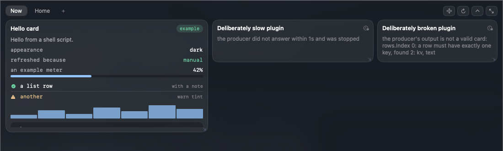

# uDeck

A panel that lives at the top edge of your Mac's screen. Push the cursor up to
the middle of whichever screen you are on and it drops down; on a MacBook's
built-in display it grows out of the notch, on an external display it drops from
the same place. Inside are tabs, and in each tab a grid of windows you drag and
resize. One button fills the screen, the same button gives it back. Switch to
another application and it retracts on its own.

**Everything you see in it is a plugin.** uDeck itself is only the shell — the
window, the tabs, the grid, the settings and the plugin runtime. A fresh install
shows an empty panel and a way to add something to it. That is the design, not
a missing feature.



A plugin is a folder with a manifest and an executable that prints JSON:

```sh
#!/bin/sh
echo '{ "rows": [ { "text": "Hello from a shell script." } ], "ttl": 30 }'
```

Any language, no SDK, no compiler. uDeck runs it on an interval and draws what
it prints. The full contract is in **[docs/plugin-api.md](docs/plugin-api.md)**.

---

## Why

Most panels of this kind ship a fixed set of features — a media player, a
clipboard, a timer. None of them can show *your* processes, because they were
never built to. uDeck ships the platform instead: if you can write a shell
script that prints a number, you can put that number at the top of your screen.

## Status

Early. The shell works, the plugin runtime works, and the parts most likely to
be wrong are the ones that touch AppKit's window and pointer behaviour.
See the [changelog](CHANGELOG.md) for what exists.

## Requirements

**To run it:** macOS 14 or later, Apple Silicon or Intel. No Xcode needed.

**To build it:** the macOS 26 SDK, which means Xcode 26 or its command-line
tools. The panel's surface is `NSGlassEffectView`, the system's own glass, and
a type the SDK has never heard of cannot be compiled against however carefully
its use is guarded — `@available` decides what runs, not what exists. On
macOS 14 and 15 the same build falls back to a blur at runtime; it is only the
compiler that needs the newer SDK.

## Building and running

```sh
git clone https://github.com/iillyyaa1997/udeck.git
cd udeck
swift build
.build/debug/uDeck
```

`Info.plist` is linked into the binary, so the bare executable already behaves
as a menu-bar-only application — there is no bundling step for development.
uDeck appears as a small item in the menu bar; that item is the way to quit it.

Then push the cursor to the top centre of your screen.

To run the tests:

```sh
swift test
```

To build a real application bundle:

```sh
Scripts/make-app.sh          # dist/uDeck.app, ad-hoc signed
Scripts/make-app.sh --dmg    # …and a disk image next to it
```

## Installing plugins

Put a plugin folder in `~/.udeck/plugins/`, then open the panel and add it to a
tab. The three plugins in [`examples/`](examples) are a good place to start —
copy one in and see what happens:

```sh
mkdir -p ~/.udeck/plugins
cp -R examples/hello-card ~/.udeck/plugins/
```

`~/.udeck` can be moved with the `UDECK_HOME` environment variable.

## A warning about signing

Builds of uDeck are **ad-hoc signed**, not signed with an Apple Developer ID and
not notarised. macOS will refuse to open a downloaded build on the first
attempt; right-click the application and choose Open to get the dialog that lets
you through, or run the binary you built yourself, which has no such problem.

Notarisation is intended but not paid for yet. Nothing about the architecture
changes when it arrives — only the build step.

uDeck is **not sandboxed**, and cannot be: plugins run commands. What that means
for plugin trust is spelled out honestly in
[the permissions section of the plugin API](docs/plugin-api.md#permissions) —
please read it before installing a plugin somebody else wrote.

## What it costs to leave running

Measured on an M5 Pro, release build, with two plugins installed:

| | CPU | Memory |
|---|---|---|
| Panel away, cursor anywhere | 0.1 % of one core | ~55 MB |
| Panel away, cursor parked in the menu bar | 0.3 % of one core | ~55 MB |

Plugins do not run while the panel is away — opening it refreshes everything —
so an idle uDeck is a pointer check ten times a second and nothing else. That
is a setting if you want it the other way.

## Permissions

uDeck asks macOS for **nothing**. No Accessibility, no Screen Recording, no
Automation. Install it and it works.

What it actually uses, and why none of it prompts:

| What | Why it is free |
|---|---|
| A global monitor for pointer movement and clicks | AppKit gates *keyboard* monitoring behind Accessibility, not mouse events |
| `NSScreen.safeAreaInsets` and `auxiliaryTop*Area` for the notch | public API since macOS 12 |
| `NSWorkspace` activation notifications | public, no permission |
| `CGWindowListCopyWindowInfo` bounds, to tell whether the frontmost app is fullscreen | window *titles* need Screen Recording; bounds and owners do not, and uDeck never reads a title |
| Carbon's `RegisterEventHotKey` for the keyboard shortcut | it asks the window server to deliver *one* combination to this process — unlike `NSEvent.addGlobalMonitorForEvents(matching: .keyDown)`, which sees every keystroke on the machine and needs Accessibility |

If that last one ever did become restricted, the effect would be that the
fullscreen check stops working — not a permission prompt. The panel opens over
fullscreen applications anyway by default, so the visible difference would be
none; the check exists so that the behaviour can be turned off.

The one feature that would need Accessibility — listing and switching between
running applications — is described in the plugin contract and deliberately not
implemented.

## Contributing

Yes, please — see [CONTRIBUTING.md](CONTRIBUTING.md). Contributions are accepted
under a [contributor licence agreement](docs/cla.md).

## Licence

[Apache-2.0](LICENSE). Copyright 2026 Ilya Volkov.
