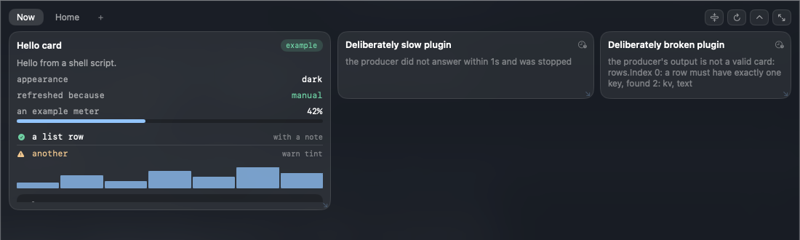

# uDeck

A panel that lives at the top edge of your Mac's screen. Push the cursor up to
the middle of whichever screen you are on and it drops down; on a MacBook's
built-in display it grows out of the notch, on an external display it drops from
the same place. Inside are tabs, and in each tab a grid of windows you drag and
resize. One button fills the screen, the same button gives it back. Switch to
another application and it retracts on its own.

**Everything you see in it is a plugin.** uDeck itself is only the shell — the
window, the tabs, the grid, the settings and the plugin runtime. A fresh install
shows an empty panel and a way to add something to it. That is the design, not
a missing feature.



A plugin is a folder with a manifest and an executable that prints JSON:

```sh
#!/bin/sh
echo '{ "rows": [ { "text": "Hello from a shell script." } ], "ttl": 30 }'
```

Any language, no SDK, no compiler. uDeck runs it on an interval and draws what
it prints.

* **[Writing a plugin](docs/writing-a-plugin.md)** — the walkthrough: an empty
  folder to something on the panel, in ten minutes.
* **[The plugin contract](docs/plugin-api.md)** — the reference: every field,
  every rule, every limit, and why each is there.

---

## Why

Most panels of this kind ship a fixed set of features — a media player, a
clipboard, a timer. None of them can show *your* processes, because they were
never built to. uDeck ships the platform instead: if you can write a shell
script that prints a number, you can put that number at the top of your screen.

## Status

Early. The shell works, the plugin runtime works, and the parts most likely to
be wrong are the ones that touch AppKit's window and pointer behaviour.
See the [changelog](CHANGELOG.md) for what exists.

## Requirements

**To run it:** macOS 14 or later, on Apple Silicon. No Xcode needed. The
release's uDeck.app is built for arm64 alone (0.5.0's is: `lipo -archs` says
`arm64`); `udeck-plugin`'s own archive, below, is universal.

**To build it:** the macOS 26 SDK, which means Xcode 26 or its command-line
tools. The panel's surface is `NSGlassEffectView`, the system's own glass, and
a type the SDK has never heard of cannot be compiled against however carefully
its use is guarded — `@available` decides what runs, not what exists. On
macOS 14 and 15 the same build falls back to a blur at runtime; it is only the
compiler that needs the newer SDK.

## Building and running

```sh
git clone https://github.com/iillyyaa1997/udeck.git
cd udeck
swift build
.build/debug/uDeck
```

`Info.plist` is linked into the binary, so the bare executable already behaves
as a menu-bar-only application — there is no bundling step for development.
uDeck appears as a small item in the menu bar; that item is the way to quit it.

Then push the cursor to the top centre of your screen.

To run the tests:

```sh
swift test
```

To build a real application bundle:

```sh
Scripts/make-app.sh          # dist/uDeck.app, ad-hoc signed
Scripts/make-app.sh --dmg    # …and a disk image next to it
Scripts/make-app.sh --debug  # dist/uDeck-debug.app — its own bundle id, never updates itself
```

The debug bundle is a separate application on purpose. Two copies that share a
bundle identifier share one login item — whichever ran last owns it, and either
can switch it off for both — so a debug build that pretended to be uDeck would
quietly take the login item away from the copy you actually use.

## Installing plugins

Put a plugin folder in `~/.udeck/plugins/`, then open the panel and add it to a
tab. The folder is watched, so a plugin copied in appears by itself — there is
nothing to press. The four plugins in [`examples/`](examples) are a good place
to start:

```sh
mkdir -p ~/.udeck/plugins
cp -R examples/hello-card ~/.udeck/plugins/
```

To write one of your own, start from a plugin that already works, and run it
the way uDeck will:

```sh
udeck-plugin new my-first-plugin --author "Your Name"
udeck-plugin check --strict my-first-plugin
udeck-plugin run my-first-plugin
```

`udeck-plugin` comes inside uDeck.app: **Install command** under Settings →
Plugins links it into `~/.local/bin` — no administrator password — and it
updates with uDeck. **[Writing a plugin](docs/writing-a-plugin.md)** goes on
from there: a plugin you work on is linked in — `udeck-plugin link`, or **Link
a folder…** in Settings — and runs from where it is.

Without uDeck — on Linux, or on a Mac that does not run it — take the command
from a [release](https://github.com/iillyyaa1997/udeck/releases): from 0.6.0
on, each carries it for macOS (arm64 and x86_64 in one binary) and
for Linux (x86_64 and aarch64, static: nothing else to install), and
`SHA256SUMS` over them. Check the archive before you run what is in it:

```sh
version=X.Y.Z            # the release, without its v
platform=linux-x86_64    # or linux-aarch64, macos-universal
base=https://github.com/iillyyaa1997/udeck/releases/download/v$version
curl -fsSLO "$base/udeck-plugin-$version-$platform.tar.gz"
curl -fsSLO "$base/SHA256SUMS"
grep " udeck-plugin-$version-$platform.tar.gz\$" SHA256SUMS | sha256sum -c -   # on a Mac: shasum -a 256 -c -
tar -xzf "udeck-plugin-$version-$platform.tar.gz"
"udeck-plugin-$version-$platform/udeck-plugin" --version
```

Downloaded with `curl` it runs as it is. A copy a browser downloaded on a Mac
carries the quarantine mark, and macOS will not run an ad-hoc signed command
that has it until the mark is taken off (`xattr -d com.apple.quarantine
udeck-plugin`) — the same signing story as the application's, below.

In a plugin repository's CI, use the container image
`ghcr.io/iillyyaa1997/udeck-plugin` (linux/amd64, linux/arm64), **by the digest
the release names** — in its notes and in `udeck-plugin-image.txt` — not by its
tag:

```sh
docker run --rm --network none -v "$PWD:/repo:ro" \
  ghcr.io/iillyyaa1997/udeck-plugin@sha256:<digest> \
  udeck-plugin check-repo --repo /repo --strict
```

Run it on a checkout with history. Rule 18 — a changed plugin's version goes
up — compares HEAD with the commit before it. `actions/checkout` fetches only
HEAD unless told otherwise: there the rule is not checked, the check says so in
a warning, and it exits 0. GitLab CI fetches a new project's last 20 commits,
enough while the commit to compare with is among them. Give `actions/checkout`
`fetch-depth: 0`, and set `GIT_DEPTH: "0"` in GitLab CI. `--base` and `--head`
name the commits to compare when the clone holds them — the target branch's
tip, for a pull request — and do not stand in for the history: a `--base` the
clone lacks makes the check exit 2.

A plugin repository pins the one release its CI runs in
`.github/udeck-plugin.lock` — its version, the sha256 of its archives and the
image's digest, read from the base of each change — and `udeck-plugin pin`
writes it, from the latest release or `--version X.Y.Z`; `pin --check` says
whether it is what its release has. What is in each asset, the lock file, and
how a CI reads it with nothing but `sed`, are in
[docs/plugin-repository.md](docs/plugin-repository.md#where-the-command-comes-from).
It also builds from this repository:
`swift build -c release --package-path Packages/UDeckPluginFormat --product udeck-plugin`.

`~/.udeck` can be moved with the `UDECK_HOME` environment variable.

## A warning about signing

Builds of uDeck are **ad-hoc signed**, not signed with an Apple Developer ID and
not notarised. macOS will refuse to open a downloaded build on the first
attempt; right-click the application and choose Open to get the dialog that lets
you through, or run the binary you built yourself, which has no such problem.

Notarisation is intended but not paid for yet. Nothing about the architecture
changes when it arrives — only the build step.

uDeck is **not sandboxed**, and cannot be: plugins run commands. A plugin runs
as you, with everything you can do; the permissions in its manifest are a
declaration uDeck shows you before it runs, not a wall around it, and uDeck
hands plugins no secrets. What that means for plugin trust is spelled out in
[the permissions section of the plugin API](docs/plugin-api.md#permissions) and
in [SECURITY.md](SECURITY.md) — please read it before installing a plugin
somebody else wrote. A plugin marked **Verified** in the catalogue is one a
maintainer of the official repository read before merging it; that is not the
same as safe.

## What uDeck connects to, and when

uDeck goes on the network by itself for two things, both **on from the first
launch**, both with a switch that turns them off. Nothing else — and neither
sends an account, an identifier, a cookie or a list of what you have installed.

**Its own updates**, through [Sparkle](https://sparkle-project.org). uDeck asks
`https://github.com/iillyyaa1997/udeck/releases/latest/download/appcast.xml`
whether there is a newer version: straight after launch when it has not asked
in the last day — so on the very first launch too — and then once a day while
it runs. The answer appears in Settings → About. The update itself is
downloaded only when you press Install there; nothing installs by itself, and
Sparkle's system profile is not sent. **Settings → About → Check for updates
automatically** turns the daily question off; **Check now** still asks, when
you press it.

**The official plugin catalogue**, from
[`github.com/iillyyaa1997/udeck-plugins`](https://github.com/iillyyaa1997/udeck-plugins).
uDeck reads it from `api.github.com` and `raw.githubusercontent.com`, anonymously:

* about five seconds after launch, unless it was read successfully in the last
  24 hours — the very first launch included;
* once every 24 hours while uDeck runs, and an hour after a read that failed;
* when Settings → Plugins is opened and the list is more than an hour old, and
  whenever **Check now** is pressed there;
* and when you press **Install**, **Update**, **Reinstall**, **Back to** or
  **Earlier versions**, the files that needs — so GitHub learns which plugin.

A read is usually one or two requests, each carrying `User-Agent:
uDeck/<version>` and the network address any request carries; no plugin is
downloaded or installed by itself. **Settings → Plugins → Official catalogue**
turns all of it off: uDeck then makes no request about plugins at all, the
plugins you have keep running, and uDeck stops knowing about their updates.
What exactly is read, cached and counted against GitHub's limits is in
[docs/plugin-repository.md](docs/plugin-repository.md#what-udeck-fetches-and-when).

Plugins are another matter: a plugin is a program you installed, and it can
reach the network whenever it likes — see [Security](SECURITY.md).

## Updates

A release is a tag. `v0.2.0` on `main` builds, tests, signs and publishes the
archive and the update feed; the version in the tag has to match the one in
`Info.plist` or the release fails rather than shipping two different numbers.
The same release carries `udeck-plugin` — its archives, `SHA256SUMS`, and the
container image's digest, the image pushed to ghcr.io just before — all in one
`gh release create`, since a published release here can take no asset
afterwards. CI makes every one of them on each push, runs the image on both
of its platforms, and publishes nothing.

## What it costs to leave running

Measured on an M5 Pro, release build, with two plugins installed:

| | CPU | Memory |
|---|---|---|
| Panel away, cursor anywhere | 0.1 % of one core | ~55 MB |
| Panel away, cursor parked in the menu bar | 0.3 % of one core | ~55 MB |

Plugins do not run while the panel is away — opening it refreshes everything —
so an idle uDeck is a pointer check ten times a second and nothing else. That
is a setting if you want it the other way.

## Permissions

uDeck asks macOS for **nothing**. No Accessibility, no Screen Recording, no
Automation. Install it and it works.

What it actually uses, and why none of it prompts:

| What | Why it is free |
|---|---|
| A global monitor for pointer movement and clicks | AppKit gates *keyboard* monitoring behind Accessibility, not mouse events |
| `NSScreen.safeAreaInsets` and `auxiliaryTop*Area` for the notch | public API since macOS 12 |
| `NSWorkspace` activation notifications | public, no permission |
| `CGWindowListCopyWindowInfo` bounds, to tell whether the frontmost app is fullscreen | window *titles* need Screen Recording; bounds and owners do not, and uDeck never reads a title |
| Carbon's `RegisterEventHotKey` for the keyboard shortcut | it asks the window server to deliver *one* combination to this process — unlike `NSEvent.addGlobalMonitorForEvents(matching: .keyDown)`, which sees every keystroke on the machine and needs Accessibility |

If that last one ever did become restricted, the effect would be that the
fullscreen check stops working — not a permission prompt. The panel opens over
fullscreen applications anyway by default, so the visible difference would be
none; the check exists so that the behaviour can be turned off.

The one feature that would need Accessibility — listing and switching between
running applications — is described in the plugin contract and deliberately not
implemented.

## Contributing

Yes, please — see [CONTRIBUTING.md](CONTRIBUTING.md). Contributions are accepted
under a [contributor licence agreement](docs/cla.md).

## Licence

[Apache-2.0](LICENSE). Copyright 2026 Ilya Volkov.
