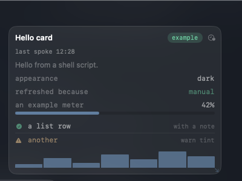
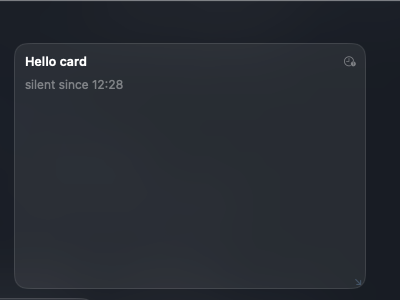

# Writing a uDeck plugin

uDeck ships no content of its own. The panel, the tabs and the grid are the
whole application; everything inside a window comes from a plugin. This document
is the contract between the two.

It is a stable, versioned contract. If you write a plugin against `api: 1` it
will keep working in later versions of uDeck, or uDeck has a bug. See
[Versioning](#versioning) for exactly what that promises.

---

## The shortest possible plugin

Make a folder, put two files in it, and drop the folder into `~/.udeck/plugins/`.

```
~/.udeck/plugins/hello/
├── manifest.json
└── hello.sh          (chmod +x)
```

`manifest.json`:

```json
{
  "id": "hello",
  "name": "Hello",
  "version": "0.1.0",
  "api": 1,
  "kind": "poll",
  "run": ["./hello.sh"],
  "interval": 5,
  "timeout": 2
}
```

`hello.sh`:

```sh
#!/bin/sh
echo '{ "rows": [ { "text": "Hello from a shell script." } ], "ttl": 30 }'
```

That is the whole thing. uDeck runs `hello.sh` every five seconds, reads the
JSON object it printed, and draws it. The script can be written in any language:
uDeck executes a file and reads its standard output, and has no opinion beyond
that.

A working example of every row type lives in
[`examples/hello-card`](../examples/hello-card).

---

## How a plugin is found

uDeck looks in `~/.udeck/plugins/` for folders containing a `manifest.json`.

**The folder name must equal the manifest's `id`.** The folder name is what the
operator sees, and the key under which their settings and permission decisions
are stored; letting the two differ would make an id collision silent.

**The folder is watched, so you do not have to tell uDeck you changed it.**
Copying a plugin in, taking one out, editing a manifest in place, adding a
translation beside it, `chmod +x` on a producer — each is noticed within about a
second and the list is re-read. Events are coalesced, so expanding an archive is
one re-read rather than one per file. The **Look again** button in the settings
screen stays, because a watcher is a thing that can fail quietly.

A folder that fails to load is not skipped — it appears in the panel with the
reason next to it. A plugin that simply never shows up is a support question; a
plugin that shows up saying `run.sh is not executable — try chmod +x` is a
five-second fix.

`~/.udeck` can be moved by setting `UDECK_HOME`. That is how uDeck's own test
suite runs against a throwaway directory, and it is a supported way to keep a
plugin set under version control somewhere else.

---

## The manifest

```json
{
  "id": "disk-space",
  "name": "Disk space",
  "version": "0.1.0",
  "api": 1,
  "kind": "poll",
  "description": "How much room is left on this machine's disks.",
  "author": "Your Name",
  "homepage": "https://example.com/plugin",
  "run": ["./disk.py"],
  "interval": 30,
  "timeout": 3,
  "permissions": {
    "exec": ["df", "open"]
  },
  "settings": [
    { "key": "warn_percent", "type": "int", "default": 85, "min": 50, "max": 99,
      "label": "Warn above" }
  ],
  "window": { "defaultWidth": 4, "defaultHeight": 3, "minWidth": 3, "minHeight": 2 }
}
```

| Field | Required | Meaning |
|---|---|---|
| `id` | yes | Lowercase letters, digits and `- _ .`, 1–64 characters, matching the folder name. |
| `name` | yes | What the operator sees. |
| `version` | yes | Your plugin's version. Changing it re-asks the permission question — see [Permissions](#permissions). |
| `api` | yes | The contract version this plugin is written against. Currently `1`. |
| `kind` | yes | `poll` or `resident`. Only `poll` is implemented; see [Runtime kinds](#runtime-kinds). |
| `run` | yes | The command, as an argument vector. Never a shell string. |
| `interval` | for `poll` | Seconds between runs. At least **1** — a producer is a whole process, and asking for one more often than that is a busy loop rather than a poll. |
| `timeout` | for `poll` | Seconds a single run may take. At least **0.05**, and shorter than `interval`. |
| `description`, `author`, `homepage` | no | Shown to the operator. |
| `permissions` | no | What the plugin needs. See [Permissions](#permissions). |
| `settings` | no | Values the operator can change, which uDeck renders a settings screen for. |
| `window` | no | Size hints in grid cells: `defaultWidth`/`minWidth` in columns (1–12), `defaultHeight`/`minHeight` in row units (1–24). A height past 24 is refused rather than quietly drawn as 24. |

### How `run` is resolved

* `"./tool"` or `"sub/dir/tool"` — relative to the plugin's own folder, so a
  plugin can ship its own executable without knowing where it was installed.
  A relative path that climbs out of the folder is refused.
* `"/usr/bin/python3"` — an absolute path, used as given.
* `"python3"` — a bare name, looked up on uDeck's configured search path
  (`/usr/local/bin`, `/opt/homebrew/bin`, `/usr/bin`, `/bin`, `/usr/sbin`,
  `/sbin` by default, changeable in settings).

The bare-name case deliberately does **not** use the `PATH` uDeck inherited.
uDeck can be started from Finder, from a shell or by `launchd`, each with a
different environment, and a plugin that works when started one way and fails
another is close to impossible to debug.

### Runtime kinds

`poll` — uDeck runs the command on an interval, reads one card from its standard
output, and the process exits. This is what is implemented today, and it is the
right shape for anything that reports state.

`resident` — a long-lived process owning a live surface (a terminal, an event
stream). The manifest format describes it now so that adding it later cannot
break plugins written today, but **uDeck does not run resident plugins yet**: a
manifest declaring `"kind": "resident"` loads, validates, and reports that this
version will not start it.

---

## The card

A `poll` plugin prints exactly one JSON object to standard output and exits.

```json
{
  "state": "warn",
  "title": "Disk space",
  "chip": "Backup 92 % full",
  "rows": [
    { "meter": { "value": 0.92, "label": "Backup",
                 "caption": "40 GB free of 500 GB", "state": "warn" } },
    { "kv": ["unreadable lines", "1", "warn"] }
  ],
  "actions": [ { "label": "Open Backup", "run": ["open", "/Volumes/Backup"] } ],
  "ttl": 120
}
```

| Field | Default | Meaning |
|---|---|---|
| `state` | `"ok"` | `ok`, `warn`, `crit` or `unknown`. Colours the card, and the island while the panel is away. |
| `title` | the manifest's `name` | Overrides the window title. |
| `chip` | none | A short badge next to the title. Keep it to a couple of words. |
| `rows` | `[]` | The body. See [Row types](#row-types). |
| `actions` | `[]` | Buttons. See [Actions](#actions). |
| `ttl` | the host's default (60 s) | **How long this card can be trusted.** See below. |

Anything printed to standard **error** is kept and shown to the operator as the
plugin's diagnostics. Use it freely: it is where a producer explains itself.

### `ttl` is the most important field

Past `ttl`, uDeck dims the card, marks it, and says when it last spoke. Past
three times `ttl`, it hides the values entirely and shows `unknown`.

This exists because **"the source is quiet" must look like neither "everything
is fine" nor "everything is broken".** Plenty of real sources go quiet on
purpose — a daemon that exits when the last session closes, a backup that runs
only overnight. A panel that cried wolf every night would be ignored within a
week, and an ignored panel is a dead one. Equally, a stale number shown as if it
were current is how a real outage hides inside a green signal.

| Past `ttl` | Past three times `ttl` |
|---|---|
|  |  |
| The values are still there, dimmed, with the time they were produced. | The values are gone. Only when they last existed is shown. |

So: set `ttl` to roughly how long your data stays true, not to your `interval`.

And the corollary for your own producer: **idle is not broken.** If there is
genuinely nothing happening, say so calmly — `"state": "ok"` with a row that
says as much. Reserve `unknown` for "I could not find out", and put the reason
in the card.

### Row types

Every row is an object with **exactly one** key naming its type. A row with two
type keys is an error, not a guess, and uDeck will say so rather than pick one.

```json
{ "text": "a plain line" }

{ "kv": ["label", "value"] }
{ "kv": ["label", "value", "warn"] }          // the third element tints the value

{ "meter": { "value": 0.32, "label": "week", "caption": "32%", "state": "ok" } }
                                               // value is 0…1 and is clamped

{ "list": [
    { "text": "u-pilot", "note": "1d15h", "icon": "wait", "state": "warn" },
    { "text": "print-lab" }
  ] }

{ "spark": [30, 52, 41, 68] }
{ "spark": { "values": [30, 52, 41], "caption": "last hour" } }

{ "table": { "columns": [ {"title": "branch"}, {"title": "min", "align": "trailing"} ],
             "rows": [ ["release/1043", "12"], ["main", "8"] ] } }

{ "log": ["04:14 restic ok", "04:02 snapshot lock"] }
```

`icon` is a closed vocabulary: `ok warn crit wait run idle done pause info dot`.
It is closed on purpose — an open-ended icon name would let one plugin dress
itself up as a different application inside the panel.

`state` anywhere is one of `ok warn crit unknown`.

There is one further type, `canvas`, which is a plugin drawing its own content:

```json
{ "canvas": { "kind": "svg", "payload": "…", "height": 120 } }
```

It is **described by the format and not drawn by this version.** It appears as a
labelled placeholder. When it does arrive it will be drawn inside a frame uDeck
owns, so that a plugin drawing itself can never pass as something uDeck drew.

A row type uDeck does not recognise is kept and rendered as a visible
diagnostic, not dropped. A hole in a card with no explanation is a bug report
waiting to happen.

### Actions

```json
{ "label": "Empty the cache", "run": ["./tools/purge"], "confirm": "Delete every cached file?" }
```

**uDeck runs the command, not your plugin.** That is what makes the `exec`
permission mean something: if the operator did not grant `exec` for that
command, the button does nothing and says why — in code your plugin does not
control.

Matching is literal. A grant for `df` permits the action `["df"]`, which uDeck
resolves on its own search path — and nothing else: not `/bin/df`, not
`/tmp/mine/df`, not `./df`. If your action runs a tool you shipped, declare the
path you will use (`"exec": ["./tools/refresh"]`) and run exactly that. The
operator then reads the path they are agreeing to rather than a name that could
mean any file on the machine.

The action's environment is built the same way a producer's is — a known search
path, a UTF-8 locale, and nothing carried over from however uDeck was started.

`confirm`, when present, asks the operator before running. Use it for anything
that changes something.

**The grant follows the version, and the manifest has to still be asking.** A
grant is decided against the `version` in your manifest, so bumping it re-asks —
and an action runs only when the manifest on disk *now* declares `exec` for that
command. A version that drops a permission drops the buttons that used it, in
the same release rather than the next one the operator happens to reinstall.

**A relative path is resolved with symlinks followed, on both sides.** Declaring
`exec: ["./tools/refresh"]` means the file at that path inside your folder. If
it is a symlink pointing outside the folder, it does not run — the operator read
a path and agreed to it, and a name that can be repointed afterwards is not a
path they agreed to.

---

## Settings

A manifest can declare settings, and uDeck renders a settings screen for them.
Your plugin never has to ship a settings UI or invent a config file.

```json
{ "key": "list_rows", "type": "int", "default": 6, "min": 0, "max": 40,
  "label": "Sessions to list", "help": "0 shows the counts only." }
```

| `type` | `default` | Extra fields |
|---|---|---|
| `bool` | `true` / `false` | — |
| `int` | a number | `min`, `max` |
| `string` | a string | — |
| `enum` | one of the option values | `options`: `[{ "value": "x", "label": "X" }]` |

`key` is lowercase letters, digits and underscores. `label` is what the operator
sees and must not be blank. A value the operator stored that no longer fits the
declared range is brought back into it on read, so tightening `max` in a new
version of your plugin does not break their settings.

### How settings reach your plugin

As environment variables, holding **JSON**:

```
UDECK_SETTING_WARN_PERCENT=85
UDECK_SETTING_HIDE_SYSTEM=true
UDECK_SETTING_VOLUMES="physical"
```

JSON, not bare text, so a plugin can tell `false` from `"false"` and `12` from
`"12"` without guessing. Read them defensively: a missing or unparseable
variable should fall back to your declared default rather than crash.

### The rest of the environment

| Variable | Meaning |
|---|---|
| `UDECK_API` | The contract version uDeck is speaking (`1`). |
| `UDECK_PLUGIN_ID` | Your plugin's id. |
| `UDECK_PLUGIN_DIR` | Your plugin's folder. Also the working directory. |
| `UDECK_CACHE_DIR` | A directory that is yours to write in. Created before each run. |
| `UDECK_APPEARANCE` | `dark`. The panel hangs over whatever is on screen, so it does not follow the system appearance; the variable exists so that it can start to without breaking you. |
| `UDECK_REFRESH_REASON` | `launch`, `interval` or `manual`. |
| `UDECK_LANG` | The language the panel is currently speaking, as a code: `en`, `ru`. Answer in it if you can, and fall back to whatever you write in if you cannot. |
| `PATH` | uDeck's configured search path, not the one it inherited. |
| `HOME`, `LANG`, `LC_ALL`, `TMPDIR` | `LANG` and `LC_ALL` are set to `en_US.UTF-8` so a producer can print UTF-8 without configuring a locale. |

`UDECK_LANG` is the one to read, not `LANG`. `LANG` and `LC_ALL` are pinned to a
UTF-8 locale on purpose — they are there so your runtime prints UTF-8 rather
than mangling anything non-Latin, and they stay pinned whatever language the
panel is in. A producer that picks its language from `LANG` will always be in
English; one that reads `UDECK_LANG` follows the panel.

The environment is **built, not inherited.** Nothing else from uDeck's own
environment is passed through, which is deliberate: a third-party plugin should
never see whatever secrets happen to be in the shell that started the app.

---

## Speaking more than one language

Two different things are translated in two different ways, because they are read
at two different times.

**Your cards** are made when your producer runs, so uDeck tells it which language
to answer in and gets out of the way. Read `UDECK_LANG` — `en`, `ru` — and print
your text in it. There is no format for this and nothing to declare: use
whatever your language already has, a dictionary, gettext, a table of strings.
A producer that ignores the variable keeps working exactly as it did.

```sh
case "$UDECK_LANG" in
  ru) title="Сборки" ;;
  *)  title="Builds" ;;
esac
```

**Your manifest** is read without running you at all — it is what the operator
sees in the plugin list and in the sheet that asks whether to allow you — so it
is translated on disk. Put a `manifest.<code>.json` next to `manifest.json`, one
file per language, as many as you like:

```
my-plugin/
  manifest.json
  manifest.ru.json
  manifest.de.json
  run.sh
```

A translation holds strings and nothing else:

```json
{
  "name": "Наблюдатель",
  "description": "Смотрит за вещами.",
  "settings": {
    "only_failing": {
      "label": "Только упавшие",
      "help": "Скрыть всё, что в порядке."
    },
    "sort": {
      "label": "Сортировать по",
      "options": { "name": "имени", "age": "возрасту" }
    }
  }
}
```

Rules, all of which follow from that one:

- **A translation can never change what your plugin does.** There is no `run`
  here, no `permissions`, no `id` — not "ignored", but absent from the format.
  The operator read what you asked for and agreed to it; a file arriving later
  must not be able to change what he agreed to.
- **Settings are matched by `key`, options by `value`.** Those are what the
  setting is *stored* as and are never translated — only the label beside them.
  A key you did not declare in `manifest.json` is ignored: a translation renames
  a setting, it does not invent one.
- **Anything you leave out falls back**, field by field, to `manifest.json`. A
  half-finished translation shows the half that is finished.
- **The file name is `manifest.<code>.json`**, where the code is two or three
  letters and an optional region: `ru`, `de`, `pt-BR`. Anything else —
  `manifest.backup.json`, `manifest.old.json` — is not a language and is left
  alone.
- **A translation that will not parse costs that one language.** It is reported
  next to your plugin in the settings, and your plugin goes on running in the
  language its manifest is written in.
- **A language uDeck does not speak yet is still kept.** Ship `manifest.ja.json`
  today and it starts being used the day uDeck learns Japanese.

---

## Permissions

A manifest declares what it needs:

```json
"permissions": {
  "read":    ["~/Notes/*.md"],
  "write":   ["~/.udeck/cache/mine/*"],
  "exec":    ["df", "open"],
  "network": ["api.example.com"],
  "screen":  false,
  "secrets": ["my-service-token"]
}
```

uDeck shows the operator what the plugin asked for, and does not run it until
they agree. If they decline, the plugin does not run at all.

**Be honest with yourself about what this is.** A plugin is an ordinary program
that uDeck launches as the operator, and uDeck does not sandbox it — it cannot,
because plugins are expected to run commands. Once your process is running,
nothing in uDeck stops it from reading a file it did not declare. What is real
is:

* **uDeck decides whether to launch you at all.** All of your declared
  capabilities, or none: half-granting would be theatre.
* **Services uDeck performs for you are genuinely gated.** It runs your card's
  actions, and refuses ones you were not granted `exec` for. It hands over
  secrets, or does not.

So uDeck's interface says *"this plugin asks to…"*, never *"this plugin is
forbidden from…"*. Declare honestly anyway: the declaration is what the operator
reads when deciding whether to trust your plugin at all, and an understated one
is a good reason not to.

Changing your plugin's `version` re-opens the question, so an update that starts
asking for more cannot inherit an answer given to an earlier version.

`screen` needs macOS Accessibility and is **not implemented in this version.**

---

## Versioning

`api` is the contract version. This document describes `api: 1`.

The promise: **a plugin written against `api: 1` keeps working.** Concretely,
within a major contract version uDeck will not remove a field, change what a
field means, tighten validation on something that used to be accepted, or change
how an existing row type is interpreted.

What may change without a new `api`:

* New optional manifest fields, new row types, new settings types, new
  environment variables. Old plugins ignore them.
* Visual design. A plugin describes what to show, not how it looks — that is the
  whole point of a declarative card, and it is what lets one plugin set look
  right next to another.

What a new `api` would be for: changing or removing something that exists today.
When `api: 2` arrives, uDeck will keep running `api: 1` plugins.

A manifest declaring a **higher** `api` than uDeck understands is refused rather
than guessed at, with a message naming both numbers. A manifest declaring a
lower one keeps working — that is what the number is for.

---

## Writing a producer that behaves

* **Print one JSON object and nothing else on standard output.** Diagnostics go
  to standard error, where uDeck keeps them for you.
* **Do not police your own deadline — uDeck does.** A stock macOS has neither
  `timeout` nor `gtimeout`, so a shell producer genuinely cannot. uDeck kills a
  run that overruns `timeout`, and kills whatever it started with it.
* **Do not leave background children.** Every run gets a process group of its
  own, and uDeck ends the group when the run ends — on a deadline, on the
  output cap, and on an ordinary successful exit alike. `(sleep 300 &)` does not
  survive your producer, and neither does a child that ignores `SIGTERM`: the
  polite signal goes to the group, and what is left after the grace period is
  killed. If your plugin genuinely needs something long-lived, it wants to be a
  `resident` plugin, which is a format that exists and an implementation that
  does not yet.
* **Never call anything that can block forever.** The classic is a command
  that touches a network mount whose server has gone away: it does not fail, it
  waits, and it may wait for the rest of the session. Anything speaking to a
  daemon over a socket can do the same — accept the connection and never
  answer. Bound the call with a timeout of your own, restrict it to what cannot
  hang (`df -l` is local filesystems only), or read a file the source writes
  instead.
* **Be fast.** A five-second interval means your producer runs seventeen
  thousand times a day. Read small files; avoid walking large directories.
* **Fail partially, not totally.** One unreadable file out of thirty should
  count as one unreadable file, not poison the card.
* **Do not print more than a megabyte.** uDeck stops a producer that does, and
  keeps only the first megabyte — the count it reports is what you actually
  sent, the buffer is what it was willing to hold.

### What uDeck does when a producer misbehaves

Each of these produces a different, readable message on the card:

| What happened | What the operator sees |
|---|---|
| Ran past `timeout` | `the producer did not answer within 3s and was stopped` |
| Exited non-zero | `the producer exited with status 3` |
| Printed nothing | `the producer printed nothing` |
| Printed something that is not a card | the parse error, naming the field |
| Printed too much | `the producer printed more than the 1048576-byte limit` |
| Could not be started | the reason it could not |
| Was never permitted | which capability is missing |

**And it is asked again less often.** After a failure the wait doubles — 5 s,
10 s, 20 s — capped at a minute, and reset by the first run that produces a
card. A plugin that is broken should not cost the machine what a plugin that
works costs. The operator's ⟳ button ignores the backoff, so the way to test a
fix is to press it rather than to wait.

---

### How much a card may contain

The output limit is in bytes, and bytes are the wrong unit for what makes a
panel slow. A megabyte of `{"text":"x"}` is about eighty thousand rows — well
inside the byte limit, and enough to stop the panel responding while it lays
them out. So a card is also bounded by what it asks uDeck to draw:

| | Limit |
|---|---|
| Rows in a card | 200 |
| Items in a `list` | 200 |
| Rows in a `table` | 200 |
| Columns in a `table` | 12 |
| Lines in a `log` | 200 |
| Values in a `spark` | 512 |
| `actions` on a card | 12 |
| Words in one action's `run` | 64 |
| Characters in any single piece of text | 1000 |

"Any single piece of text" is every string uDeck draws, an action's `label` and
`confirm` and each word of its `run` included. A card is a card, not a control
panel: if you have twelve buttons, the thirteenth is telling you the plugin
wants a window of its own rather than a card.

Going over is not an error — the card is drawn up to the limit and gains a row
saying it was cut short, so a card that is mostly useful and slightly too long
still shows the useful part. But the notice is there for you: if you see it, the
card is telling you to send less.

If you have more to say than this, a card is the wrong shape for it. Summarise,
and put the detail behind an action.

### One thing uDeck cannot clean up

If uDeck itself is killed — force-quit, or crashed — while one of your runs is
in flight, that run is orphaned along with its process group. It keeps going
until it finishes on its own, and a producer that never finishes keeps going
until the machine restarts.

macOS offers no way to say "die when my parent dies", so this is a real hole
rather than an oversight. It is bounded — at most one group per plugin, and only
when the host died at exactly the wrong moment — but it is a reason to write
producers that terminate on their own even when nobody is waiting for them.

Measured, so the size of the hole is known: with a plugin that hangs on purpose
and ignores `SIGTERM`, polled every five seconds for a minute, a **running**
uDeck left nothing behind at all. Every stray process observed came from the
host being killed mid-poll.

## Testing your plugin

Run it the way uDeck will, and check that what comes out is a card:

```sh
cd ~/.udeck/plugins/hello
UDECK_API=1 UDECK_APPEARANCE=dark UDECK_REFRESH_REASON=manual \
  ./hello.sh | python3 -m json.tool
```

Then let uDeck load it: open the panel, add it to a tab, and watch what it says.
Use the ⟳ button to run it on demand.

The four plugins in [`examples/`](../examples) are also uDeck's own test
fixtures: `hello-card` uses every row type, `disk-space` is a real plugin with
its own tests and a translation, `slow-plugin` hangs on purpose, and
`broken-card` prints something that is not a card. They are the fastest way to
see what each failure looks like.
